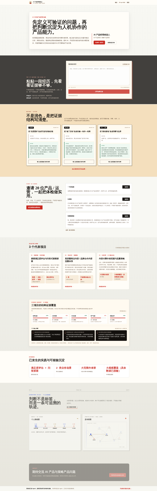

# Product Manager Portfolio Template：用自己的 Agent，把经历变成可发布的作品集

面向**产品经理、AI 产品经理与产品运营**的开源作品集生成系统。它不是在线简历编辑器，而是一套给你自己的 Agent 使用的方法、四种展示模板和本地检查工具：从材料盘点、关键追问和三个案例精选，到证据审计、隐私检查、静态网站生成与 GitHub Pages 发布。

> Open-source **product manager portfolio template** and **operations portfolio generator** with Agent-guided case studies, evidence review, privacy checks, four narrative layouts, and a deployable Next.js static site.

| 适合谁 | 最终得到什么 | 与普通作品集模板的区别 |
| --- | --- | --- |
| 产品经理、AI / 策略 / 增长产品、产品运营、策略 / 增长运营 | 3 个代表案例 + 可检查的数据文件 + 可部署网站 | 不只换皮：Agent 帮你选项目、补证据、查隐私，再匹配叙事结构 |

[**先诊断一段经历 →**](https://haimuhaimu.github.io/strategy-product-portfolio-template/#instant-diagnostic) · [**用 Agent 开始制作 →**](https://haimuhaimu.github.io/strategy-product-portfolio-template/start/) · [**检查并下载作品集 →**](https://haimuhaimu.github.io/strategy-product-portfolio-template/launchpad/) · [**比较四种模板 →**](https://haimuhaimu.github.io/strategy-product-portfolio-template/templates/)



[](https://github.com/haimuhaimu/strategy-product-portfolio-template/actions/workflows/portable-build.yml)
[](https://haimuhaimu.github.io/strategy-product-portfolio-template/)
[](https://nextjs.org/)
[](LICENSE)

## 为什么不是普通 Portfolio Template

大多数 portfolio template 解决的是“如何展示”；这个项目先解决“应该展示什么、凭什么相信”。Agent 会从原始材料中精选三个案例，区分事实、个人贡献和待补充信息，再根据证据类型选择 Atlas、Growth、Systems 或 AI Workflow。它既能用于产品经理与运营求职，也能承接 AI product manager portfolio 和 product case study 的证据表达，而不是退化为换配色的个人主页。

核心闭环是：`材料盘点 → 单问题追问 → 三案例精选 → 证据与隐私检查 → 模板匹配 → GitHub Pages 发布`。整个过程不要求上传材料到服务端，也不会为填满页面而编造指标、职责或结果。[查看 portfolio-story-builder Agent 工作说明 →](skills/portfolio-story-builder/)

## 先体验：诊断一段项目经历

打开[在线 Demo 的即时诊断](https://haimuhaimu.github.io/strategy-product-portfolio-template/#instant-diagnostic)，粘贴一段项目经历，即可在浏览器本地检查结果证据、口径、方法、资产和贡献边界。原文不会上传，输出只包含覆盖情况、常见隐私风险数量和最优先的补证据问题。诊断完成后可以一键复制可转发链接：链接只在 URL Fragment 中携带带版本号的安全白名单结果，不含原文、敏感命中或空泛表达详情，接收者打开即可看到结果并继续自测；也可以下载本地生成的 PNG 安全分享卡。

安全分享链接不使用 query、服务端 API 或外部请求。链接与 PNG 分享卡中的体验入口均在浏览器中根据当前 `origin` 和 GitHub Pages `basePath` 动态生成，因此 fork、仓库子路径和自定义域名部署都可直接使用。非法、被篡改或超长的分享载荷会被拒绝，不会回填为诊断结果。

这一步不需要简历、账号或 `projects.json`。它只判断文字中的证据结构，不替代事实核验，也不会自动编造缺失结果。首页另有 3 组面向产品经理与运营的匿名 Before / After 教学案例，可以直接载入诊断区；如果希望邀请同事参与首批 20 位免费体验，也可一键复制短版、社群版或私聊版招募文案。所有新增交互均在浏览器本地完成，不调用服务端 API。

## 两种完整制作方式

### A. 用自己的 Agent（推荐）

任何能够访问网页、读取仓库并生成文件的个人 Agent 都可以使用这套方法。把简历、项目材料和下面的提示词一起交给它：

```text
请作为我的作品集 Agent，先阅读：
https://github.com/haimuhaimu/strategy-product-portfolio-template/blob/main/skills/portfolio-story-builder/SKILL.md

请盘点我提供的全部材料，每次只问一个最关键的问题，从全部经历中精选三个代表项目。只使用我提供或确认的事实，不要编造指标、客户、职责或结果；信息不足时写“待补充”。发布前检查隐私，并生成 v2 projects.json。如果你有目标仓库权限，请接入 data/projects.json，运行仓库已有的测试、代码检查、构建和网页检查，通过后部署预览。
```

完整可复制版本在 [`/start/`](https://haimuhaimu.github.io/strategy-product-portfolio-template/start/)。工作过程是：

`把材料交给 Agent → 回答少量关键问题 → 获得并发布作品集`

### B. 已有 `projects.json`

打开[作品集检查与下载](https://haimuhaimu.github.io/strategy-product-portfolio-template/launchpad/)，在浏览器本地导入文件。工具会检查文件结构、三个代表项目、占位内容、证据完整度、隐私和内容关联，并给出“需要处理 / 可以继续 / 检查通过”的明确结论。

文件不会上传；刷新页面即可清空。通过隐私与内容关联检查后，可以分别下载 5 个发布文件：

- `projects.json`
- `audit-report.json`
- `RELEASE_CHECKLIST.md`
- `SHARE_COPY.md`
- `SHOWCASE_ENTRY.json`

## Agent 会在后台做什么

1. 盘点简历、项目文档和零散材料，确认目标岗位与公开边界。
2. 一次只追问一个高价值问题，材料足够时直接继续。
3. 从全部经历中精选三个项目，覆盖核心能力、复杂推进和差异化。
4. 检查结果口径、个人贡献与团队边界，不虚构指标或因果。
5. 删除内部链接、用户明细、密钥、项目代号和未经确认的精确数据。
6. 生成 v2 `projects.json`，有仓库权限时继续接入、测试、构建和部署。

## 四种展示结构

四种结构读取同一份作品集事实，只调整招聘官先看到的信息顺序：

| 展示结构 | 优先突出 | 更适合的材料 |
| --- | --- | --- |
| [Atlas](https://haimuhaimu.github.io/strategy-product-portfolio-template/templates/atlas/) | 个人判断、代表项目与证据图谱 | 综合型产品或运营经历，三个项目能共同支撑一条判断主线 |
| [Growth](https://haimuhaimu.github.io/strategy-product-portfolio-template/templates/growth/) | 指标、实验与增长闭环 | 增长、转化、留存材料较强，并且有基线、对照、时间窗或护栏 |
| [Systems](https://haimuhaimu.github.io/strategy-product-portfolio-template/templates/systems/) | 系统机制、资产与协作边界 | 平台、策略、治理、跨团队项目，能拿出采用事实或机制资产 |
| [AI Workflow](https://haimuhaimu.github.io/strategy-product-portfolio-template/templates/ai-workflow/) | 人机工作流、评估、护栏与回滚 | AI、Agent、自动化项目，能说清任务边界、评估和人工接管 |

选择时不要先看模板名字，先看现有材料：跨项目判断与证据回链完整，选 Atlas；指标口径、实验和护栏完整，选 Growth；规则、系统边界、采用与协作契约更强，选 Systems；任务、人机分工、评估、降级和回滚更强，选 AI Workflow。材料暂时支撑不了某套结构时，先补证据，不要把目标岗位想看到的效果写成已经发生的事实。

[模板库](https://haimuhaimu.github.io/strategy-product-portfolio-template/templates/)保留四种结构的快速比较；四个详情页会进一步解释适合与不适合人群、招聘官阅读路径、证据清单、常见误用、Agent 补材料方法和 `projects.json` 字段映射。[作品集检查与下载](https://haimuhaimu.github.io/strategy-product-portfolio-template/launchpad/)会根据已提供的真实内容给出排序、加分理由和缺口。手动选择展示结构不能绕过隐私或内容关联检查。

## 动效原则与降级

v0.7.1 的动效只帮助读者理解信息关系，不承担内容呈现：Atlas 用档案展开与坐标扫描表达“证据可追溯”，Growth 用指标卡节奏和闭环轨迹表达“实验—复盘”，Systems 用系统域建立与连线表达“机制—边界”，AI Workflow 用“人 → Agent → 工具 → 结果 → 人工复核”的脉冲流表达人工接管、评估与回滚。页面不滚动数字，也不会为动效生成指标、状态或项目事实。

- 章节会随视口位置渐入、保持清晰，再在离开时轻柔渐出；卡片、机制节点和详情条目会分层进入，避免整页同时浮动。
- 支持 CSS view timeline 的浏览器使用滚动驱动动效；其他浏览器由轻量观察器补齐双向显隐。两种路径都保持服务端正文和关闭 JavaScript 时的完整可读。
- 自动动画只使用 `transform`、`opacity` 与 SVG `stroke` 等低成本属性，避免改变布局尺寸；移动端会减少装饰轨迹和缩短入场。
- `prefers-reduced-motion: reduce` 会关闭自动动效、滚动显现、阅读进度动画与平滑滚动，不影响导航、星图点击或键盘操作。
- hover 反馈只对 fine pointer 启用；触屏使用点击，键盘保留 `focus-visible` 与星图方向键浏览。复制、下载结果通过既有状态和 `aria-live` 反馈。

## 隐私与边界

Agent 只能依据用户材料组织内容。证据不足处应明确标记“待补充”，不得编造指标、客户、职责、结果或个人贡献。默认删除内部链接、用户明细、密钥、项目代号和未经确认可披露的精确业务数据。

自动检查不能判断组织保密规则。发布前仍需本人确认：别名是否充分、指标是否允许披露、截图是否安全、联系方式是否愿意公开。

<details>
<summary><strong>高级开发与本地发布说明</strong></summary>

### 数据接入

Agent 生成文件后，将其写入 [`data/projects.json`](data/projects.json)，再运行：

```bash
npm ci
python3 skills/portfolio-story-builder/scripts/audit_portfolio.py data/projects.json --strict --output audit-report.json
npm run test:portfolio-v2
npm run test:public
npm run lint
npm run build
npm run check:seo
```

构建结果位于 `out/`，可发布到 GitHub Pages、Vercel 或其他静态托管服务。

### 本地开发

```bash
npm ci
npm run dev
```

打开 `http://localhost:3000/`。可视化配置页位于 `http://localhost:3000/config/`，它是保留给高级使用者的本地工具，不是默认主路径。

### GitHub Pages 子路径

项目会根据 `GITHUB_REPOSITORY` 推断仓库子路径，也可显式设置：

```bash
NEXT_PUBLIC_BASE_PATH=/preview npm run build
NEXT_PUBLIC_SITE_URL=https://portfolio.example.com NEXT_PUBLIC_BASE_PATH=false npm run build
```

### 数据与代码位置

```text
skills/portfolio-story-builder/  Agent 的访谈、选项目、检查与生成说明
data/projects.json               网站读取的作品集数据
src/app/start/page.tsx           两种开始方式与通用提示词
src/app/templates/page.tsx       四种展示结构说明
src/app/launchpad/page.tsx       作品集检查与下载
src/lib/launchpad.mjs            本地检查与 5 个发布文件生成
src/app/config/page.tsx          高级本地配置工具
showcase/entries/                公开作品示例
out/                             npm run build 生成的静态网站
```

完整字段兼容性以模板类型、数据整理逻辑和测试结果为准。旧数据缺少展示结构选择时默认使用 Atlas；下载时只写入最终选择，不改写项目事实。

</details>

## Showcase 与贡献

Showcase 使用“一位贡献者一个 JSON”的方式，避免多人修改同一清单：

- 流程与字段说明：[`showcase/README.md`](showcase/README.md)
- 公开字段约束：[`showcase/schema.json`](showcase/schema.json)
- 维护者自测：[`showcase/entries/maintainer-ai-pm.json`](showcase/entries/maintainer-ai-pm.json)
- 提交入口：[Showcase Issue](https://github.com/haimuhaimu/strategy-product-portfolio-template/issues/new?template=showcase.yml)

详细能力边界见 [`skills/README.md`](skills/README.md)，版本变化见 [`CHANGELOG.md`](CHANGELOG.md)，贡献流程见 [`CONTRIBUTING.md`](CONTRIBUTING.md)。

## 开源许可

代码使用 [MIT License](LICENSE)。安全问题和敏感信息披露方式见 [`SECURITY.md`](SECURITY.md)。
