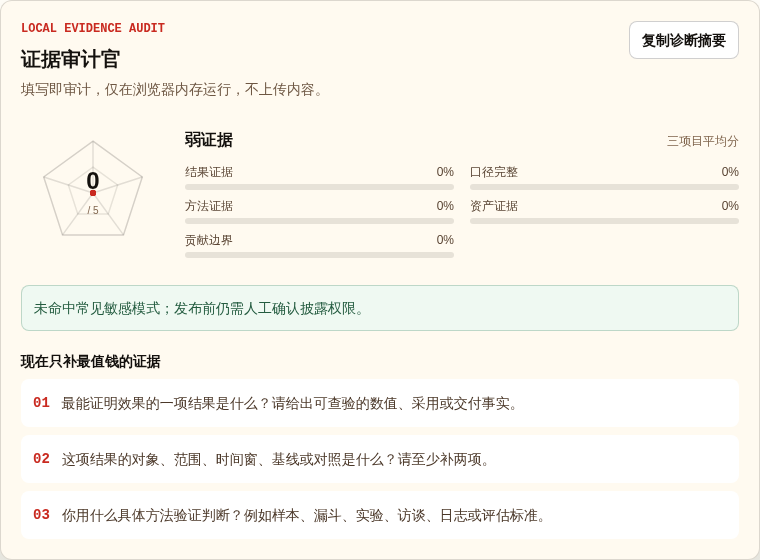

# 面向产品经理与运营的证据驱动作品集系统

**把零散经历变成 3 个代表项目、可审计的证据叙事和可直接部署的网站。** Agent Skill 是访谈与证据审计引擎，网站是最终输出；两者共同服务于同一个目标：让招聘官在 30 秒内看懂你解决了什么问题、做了什么判断、证据是否可信。

| 适合谁 | 最终得到什么 |
| --- | --- |
| 产品经理、策略 / 增长产品、产品运营、策略 / 增长运营 | **3 个代表项目** + **证据审计报告** + **可部署作品集网站** |

[**查看在线作品集 →**](https://haimuhaimu.github.io/strategy-product-portfolio-template/) · [**打开在线配置器 →**](https://haimuhaimu.github.io/strategy-product-portfolio-template/config/) · [**导入 Agent Skill →**](skills/portfolio-story-builder/)

> 如果你想稍后继续使用这套方法，或关注后续版本，可以 [Star 保存项目](https://github.com/haimuhaimu/strategy-product-portfolio-template)。


> 真实成品截图：仓库当前数据构建的作品集。配置器中的证据审计同样来自真实页面，不是聊天 UI 或概念图。



[](https://github.com/haimuhaimu/strategy-product-portfolio-template/actions/workflows/portable-build.yml)
[](https://nextjs.org/)

## 先看一个真实 Before / After

> **披露：这是维护者使用本人已确认、已脱敏材料完成的 self-test，不是第三方客户案例。** 下列内容不代表客户评价，也不外推收入、提升比例、具体组织或时间。

### 1. 原始材料摘录

> 过去付费作者挖掘通常需要 1 名 DA 或 1 名算法同学写 SQL、制定策略；现在产品和运营可借助 AI 内容理解与自动化策略自行完成。

这段材料说明了工作方式变化，但尚未交代可公开的覆盖范围和应用状态。

### 2. Skill 的唯一高价值追问

> **目前能公开确认的覆盖范围、量级与应用状态分别是什么？**

### 3. 补充证据

> 覆盖全量业务作者，规模为几十万量级；相关策略已经实际应用。

### 4. 最终项目叙事

> 过去，付费作者挖掘通常需要 1 名 DA 或 1 名算法同学写 SQL、制定策略；现在，产品和运营已能借助 AI 内容理解与自动化策略自行完成。该能力覆盖全量业务作者，量级为几十万，相关策略已经实际应用。已确认的是工作方式变化、覆盖范围和采用事实；转化、收入、留存提升、具体组织与时间均不展示。

### 5. strict audit 五维结构评分

仓库当前 `data/projects.json` 的 strict audit 实际输出为 **4 / 5**，未手填拔高：

| 结果证据 | 口径完整 | 方法证据 | 资产证据 | 贡献边界 |
| --- | --- | --- | --- | --- |
| 通过 | **待补** | 通过 | 通过 | 通过 |

未通过项来自当前审计器的 `scopeAndAttribution: false`。结构分只表示材料完整度，不代表第三方事实核验。完整公开条目见 [`showcase/entries/maintainer-ai-pm.json`](showcase/entries/maintainer-ai-pm.json)。

## 核心工作流

多数作品集工具解决排版；这套系统先解决 **选什么、凭什么、怎么讲**：

`材料盘点 → 叙事判断 → 一次一问补证据 → 精选 3 个项目 → 五维证据评分 → 30 秒测试 → 挑战模式 → 隐私检查 → 生成网站`

| 能力 | 产出 |
| --- | --- |
| 三项目精选 | 按岗位相关性、证据、个人判断与组合价值，从全部经历中选出 3 个代表项目 |
| 证据审计 | 检查结果、口径、方法、资产与贡献边界，逐项目给出 0–5 分 |
| 招聘官 30 秒测试 | 检验项目、动作、可信证据与岗位关系能否快速被理解 |
| 挑战模式 | 从招聘官视角追问归因、失败样本和贡献边界 |
| 产品 / 运营双叙事 | 产品突出问题、机制与取舍；运营突出人群、策略与经营闭环 |
| 网站输出 | 生成 v2 `projects.json`、审计报告和纯静态作品集 |

## 三种使用方式

### A. 导入 Agent Skill（推荐）

在支持 Agent Skills 的客户端中导入 [`skills/portfolio-story-builder/`](skills/portfolio-story-builder/) 目录，然后发送：

```text
请把我的简历和项目材料做成可投递的产品/运营作品集。先判断目标岗位，一次只问一个最关键的问题；从全部经历中选 3 个项目，检查证据、归因和隐私，最后生成 projects.json 和审计报告。所有事实以我的材料为准。
```

### B. 让 Agent 直接读取 Skill

让 Agent 读取 [`skills/portfolio-story-builder/SKILL.md`](skills/portfolio-story-builder/SKILL.md)，再提供上面的触发语和材料。客户端没有 Skill 导入功能时，也可按其中工作流执行。

### C. 使用可视化配置器

直接使用[在线配置器](https://haimuhaimu.github.io/strategy-product-portfolio-template/config/)，或在仓库目录运行：

```bash
npm ci
npm run dev
```

打开 [`http://localhost:3000/config/`](http://localhost:3000/config/)，完成：

`输入项目草稿 → 浏览器即时审计 → 按 1–3 条高价值追问补证据 → 导出作品集`

诊断只在浏览器内存运行，不上传填写内容；可复制不含原始敏感内容的摘要继续协作。自动检查不能判断组织保密规则，发布前仍需本人确认披露权限。

## Showcase：低冲突提交真实作品

Showcase 使用“一位贡献者一个 JSON”的方式，避免多人修改同一清单：

- 流程与字段说明：[`showcase/README.md`](showcase/README.md)
- 公开字段约束：[`showcase/schema.json`](showcase/schema.json)
- 首个维护者自测：[`showcase/entries/maintainer-ai-pm.json`](showcase/entries/maintainer-ai-pm.json)
- 提交入口：[Showcase Issue](https://github.com/haimuhaimu/strategy-product-portfolio-template/issues/new?template=showcase.yml)

Showcase 不收集邮箱、内部链接或原始敏感材料；只有公开 URL、角色标签、公开亮点、审计摘要和明确披露确认会进入条目。

## 完整安装与发布

1. 安装依赖并从 Agent 或 `/config/` 导出 `projects.json`：

```bash
npm ci
```

2. 替换 [`data/projects.json`](data/projects.json)，运行审计、测试与构建：

```bash
python3 skills/portfolio-story-builder/scripts/audit_portfolio.py data/projects.json --strict --output audit-report.json
npm run test:portfolio-v2
npm run test:public
npm run lint
npm run build
npm run check:seo
```

3. 将 `out/` 发布到 **GitHub Pages**、**Vercel** 或其他静态托管服务。

GitHub Pages 会根据 `GITHUB_REPOSITORY` 推断仓库子路径；也可显式设置：

```bash
NEXT_PUBLIC_BASE_PATH=/preview npm run build
# 自定义域名或根路径
NEXT_PUBLIC_SITE_URL=https://portfolio.example.com NEXT_PUBLIC_BASE_PATH=false npm run build
```

## 隐私与边界

Skill 依据用户材料组织内容，对证据不足处明确标记“待补充”，并在生成前检查常见敏感信息。指标、客户、职责、因果关系与个人贡献均以可核验事实为准；事实核验和最终披露权限由使用者确认。处理工作材料时，请先脱敏并遵守所在组织的保密规则。

## 仓库结构

```text
skills/portfolio-story-builder/  Agent Skill：访谈、选项目、审计与生成规范
data/projects.json               网站读取的作品集数据
src/app/config/page.tsx          可视化配置器
showcase/entries/                一位贡献者一个公开 Showcase JSON
out/                             npm run build 生成的静态网站
```

详细能力边界见 [`skills/README.md`](skills/README.md)，版本变化见 [`CHANGELOG.md`](CHANGELOG.md)，贡献流程见 [`CONTRIBUTING.md`](CONTRIBUTING.md)。

## 开源许可

代码使用 [MIT License](LICENSE)。安全问题和敏感信息披露方式见 [`SECURITY.md`](SECURITY.md)。
